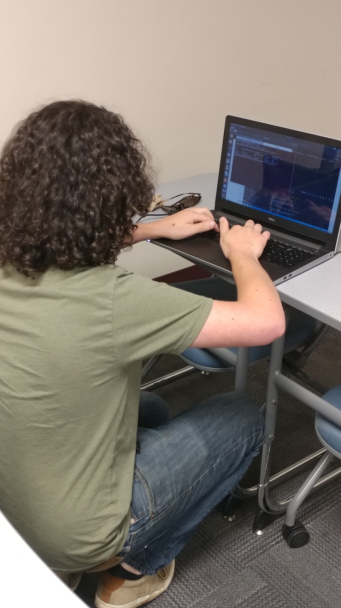
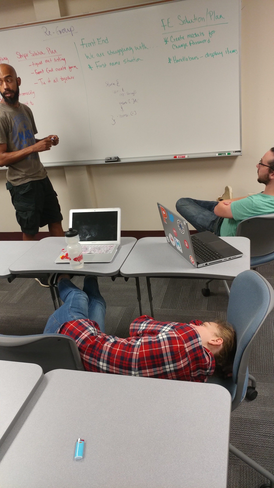
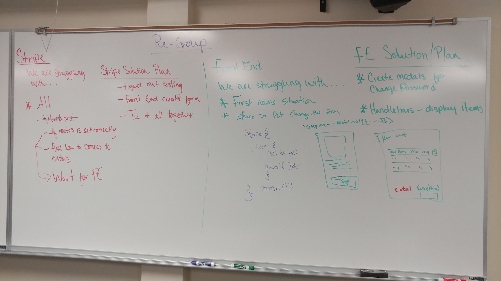
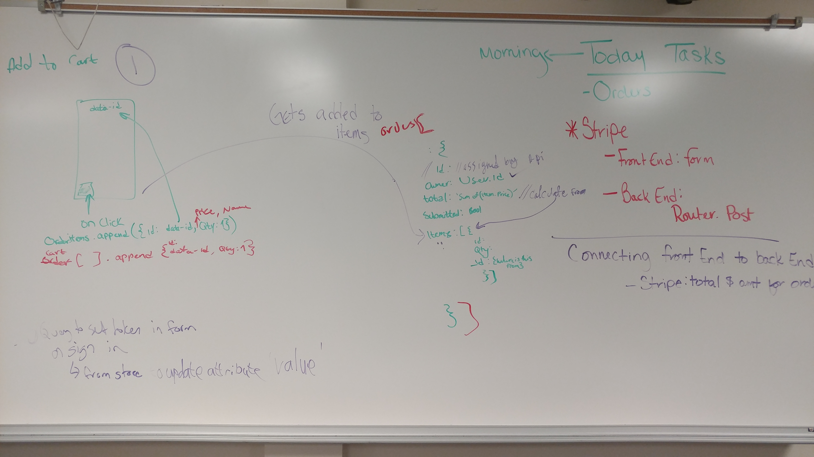

# Nozama API

## Overview
Group project to create a website for Nozama, an e-commerce company that sells OGEL mini figures.

## Related Links

## Technologies
- Node
- Express
- MongoDB
- Mongoose 
- Javascript

## Group Culture
### R.E.A.L  

Relax atmosphere and made the process fun   
Everyone is involve and participate  
Attentive to all details and got the job done  
Love to explore creative solutions when problem solving 

## Back End Plan
-Handle the user routes, order routes and item routes.  

-Then input items schema  

 -After we decided that orders was going to be the on the relationship  between items and users.  set up. 

 -Lastly, integrate Stripe

 

## API ENDPOINTS
### USERS
- POST /sign-up
- POST /sign-in
- PATCH /change-password/:id
- DELETE /sign-out/:id

### ORDERS
- GET /orders
- POST /orders
- PATCH /orders/:id
- DELETE /orders/:id

## Third Party API
- Stripe: Payment processing platform

### Items
- GET /items

## ERD

## Bonus Feature
- Security Feature: We were able to validate orders to prevent extra parameters from being added. In adddition it checks if all the parameters are up to the required amount requested. 

## Success
Ability to get Stripe to listen regardless of 401 response - communication  

Express was easy to set up - confident booster  

## Blockers
Stripe! The entire process was confusing. The testing process and getting stripe to work with orders.

## Teamwork Tips
-Communication  
-WHITE BOARD! WHITE BOARD! WHITE BOARD! 

-Assign roles ot tasks base of strength 
-Be flexible and accept change of plan  
